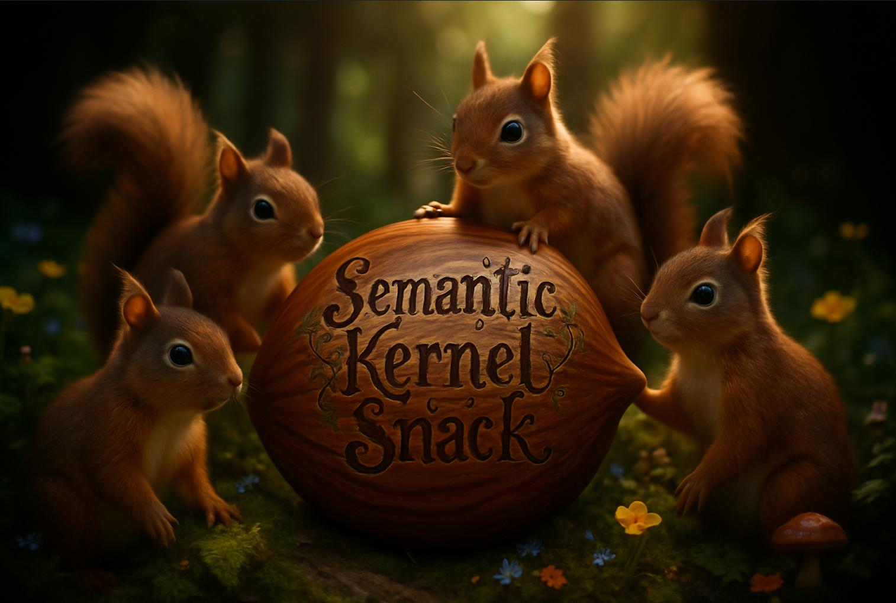

# Azure Semantic Kernel Snack

## A Delightful Tasting Menu of Semantic Kernel Capabilities

Welcome to the Semantic Kernel (SK) Snack repository! This culinary-inspired collection serves up a delectable assortment of examples showcasing Microsoft's Semantic Kernel framework for building intelligent AI Agents and AI Agentic systems.

## What's on the Menu?

Our [signature tasting menu](sk_snack.ipynb) offers a progressive journey through Semantic Kernel's capabilities, from a simple chat appetizer to a multi-agent collab main courses.

## Quick Start with Dev Container

This repository includes a `.devcontainer` configuration that provides a pre-configured environment with everything you need to run the examples. To use the Dev Container:

1. Clone this repository
2. Open in VS Code with the Dev Containers extension installed
3. When prompted, click *Reopen in Container*
4. Edit the `.env` file to add your Azure OpenAI credentials
5. Open the [sk_snack.ipynb](sk_snack.ipynb) notebook
6. Select the Python .venv as your notebook kernel
6. Follow along with each *bite* to experience the full Semantic Kernel tasting menu

## Manual Setup

If you prefer not to use the Dev Container:

1. Clone this repository
2. Copy `.env.example` to `.env` and add your Azure OpenAI credentials
3. Install dependencies with `uv sync --prerelease=allow`
4. Open the [sk_snack.ipynb](sk_snack.ipynb) notebook
5. Select the Python .venv as your notebook kernel
6. Follow along with each "bite" to experience the full Semantic Kernel tasting menu

## Additional Resources

- [Semantic Kernel Documentation](https://learn.microsoft.com/en-us/semantic-kernel/overview/)
- [Semantic Kernel GitHub Repository](https://github.com/microsoft/semantic-kernel)
- [Azure OpenAI Service](https://azure.microsoft.com/en-us/products/ai-services/openai-service/)
- [Python Semantic Kernel SDK](https://github.com/microsoft/semantic-kernel/tree/main/python)
- [Python Semantic Kernel Workshop](https://github.com/Azure-Samples/semantic-kernel-workshop/)
- [Advanced Semantic Kernel Examples](https://github.com/Azure-Samples/semantic-kernel-advanced-usage/tree/main/templates/advanced_orchestration_dapr)
- [Semantic Kernel and MCP blog](https://devblogs.microsoft.com/semantic-kernel/integrating-model-context-protocol-tools-with-semantic-kernel-a-step-by-step-guide/
)
- [Semantic Kernel process framework](https://learn.microsoft.com/en-us/semantic-kernel/frameworks/process/process-framework)
- [Azure AI Foundry Examples](https://github.com/corticalstack/azure-ai-foundry-examples)